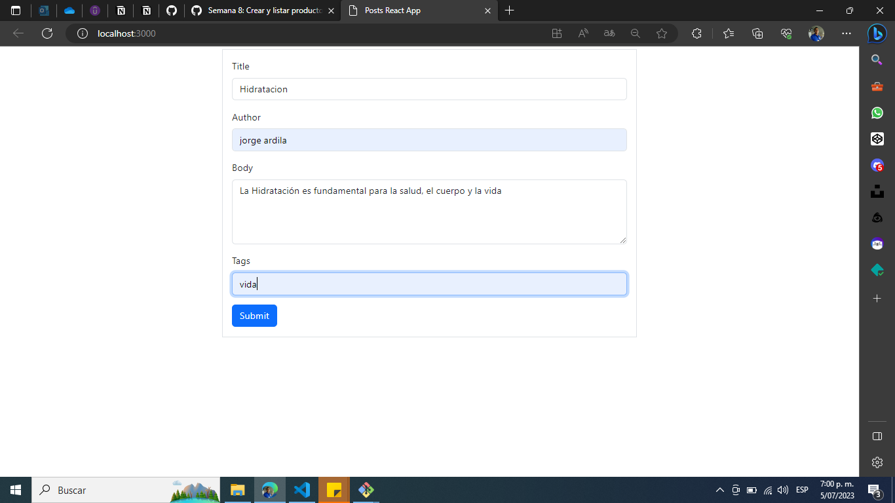
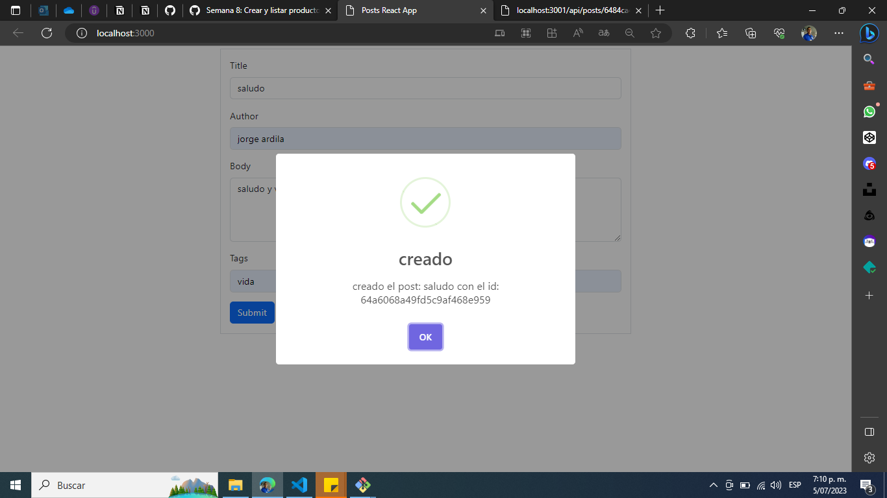
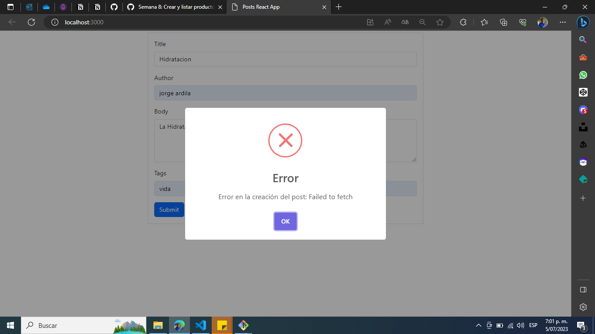
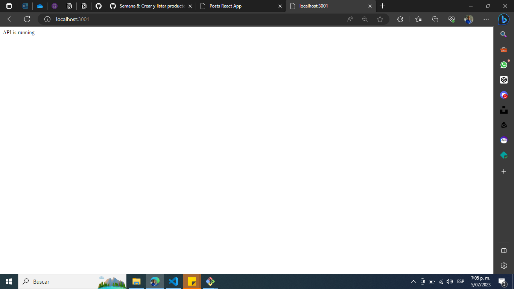
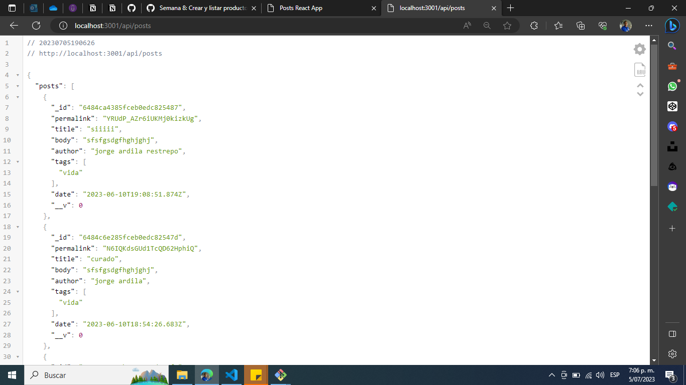
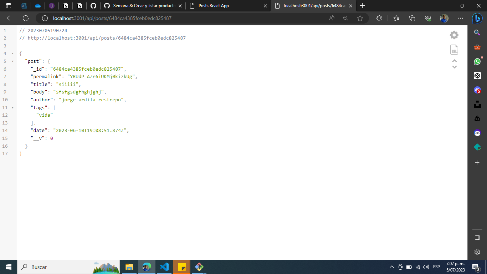

# Mi aplicación MERN

Esta aplicación fue desarrollada utilizando el stack MERN de JavaScript.

## Backend
- En el backend, se utilizó Express con algunos middlewares y MongoDB Atlas para la gestión de la base de datos, con la respectiva URI de conexión.
- Se configuran los CORS middlewares. Se utiliza arquitectura MVC.
- Se crea con los comandos `npm init -y` y se intalan las dependencias `npm install express dotenv mongoose`
- Se crea y se configura manualmente el archivo `index.js`

## Frontend
- En el frontend, se utilizó React y Node.js, se utiliza bootstrap 5 para estilizar y sweetAlert2.
- Se crea el proyecto con el comando `npx create-react-app nombre_proyecto`
- Se hacen las validaciones para las respuestas del método fetch

## Descripción
La aplicación cuenta con un componente "post" que tiene un formulario donde el usuario puede crear un nuevo post, también tiene una ruta que recupera los posts desde MongoDB Atlas y los muestra rústicamente en la página web; todos los métodos HTTP están funcionando y validados con POSTMAN, falta implementarlos en la aplicación.

## Pantallazos

### React

- localhost:3000

-sweetAlert2

- sweetAlert2 de error

### Express

- localhost:3001

- listado de post

- post por id

